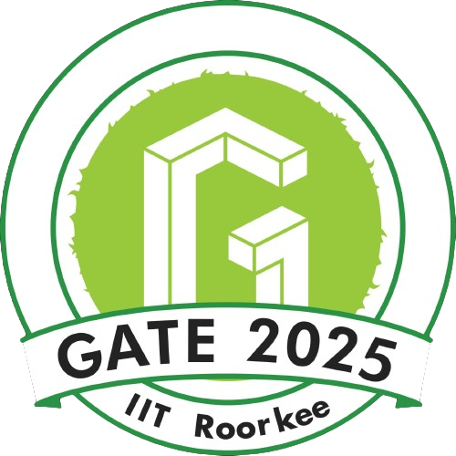

# 👋 Hi, I'm Kandarp Gajjar

### 1x AWS Certified | Computer Engineering Student | Machine Learning Enthusiast

*B.E. Computer Engineering @ LDRP-ITR, KSV*

## About Me

I'm a passionate computer science undergraduate specializing in **machine learning**, **system design**, and **cybersecurity**. I love building end-to-end solutions that solve real-world problems, from AI-powered applications to scalable full-stack systems.

Currently exploring: Advanced ML architectures, cloud-native applications, and secure system design patterns.

## Technical Arsenal

 

## Achievements & Recognition

### 🥈 National Runner-Up | Smart India Hackathon 2024

**Deepfake Detection System** - Developed a multi-modal deepfake detection system using computer vision and deep learning.

### 🥉 State Winner | SSIP Hackathon 2023  

**Grievance Portal for ONOC** - Built an consumer grievance portal for One Nation One Challan Policy.

## Certifications

<table align="center">
<tr align="center">

<td>

</td>

<td>

</td>

</tr>

<tr align="center">
<td>

**AWS Certified Cloud Practitioner**
</td>
<td>

**GATE 2025 Qualified**
</td>

</tr>
</table>

## Research Work

1. ***Fusing Retrieval Techniques for Enhanced Personalized Community Question Answering*** 
Forum for Information Retrieval Evaluation (FIRE) 2024 | [Read Paper](https://ceur-ws.org/Vol-4054/T5-2.pdf)

## Let's Connect!

I'm always open to interesting conversations, collaboration opportunities, and new challenges. Whether you want to discuss ML architectures, system design, or potential projects, feel free to reach out!
 
 

  

